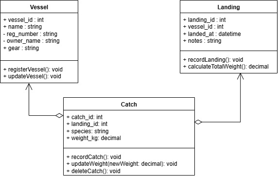

# 🚢 KAPAL  
**Katalog Pelabuhan dan Laporan Ikan**  

KAPAL adalah aplikasi sederhana yang membantu **administrasi pelabuhan** dalam melakukan pendataan **kapal** serta jumlah **tangkapan ikan**.  
Tujuan utama aplikasi ini adalah mendukung digitalisasi data pelabuhan agar lebih **efisien, akurat, dan mudah diakses**.  

---

## Fitur Utama
- Pendataan kapal yang berlabuh di pelabuhan  
- Pencatatan jumlah hasil tangkapan ikan  
- Laporan terstruktur untuk mendukung pengambilan keputusan  
- Antarmuka sederhana dan mudah digunakan  

---

## Anggota Kelompok
- **Ketua Kelompok**: Pradana Yahya Abdillah — `23/515259/TK/56625`  
- **Anggota 1**: Irfan Firdaus Isyfi — `23/520128/TK/57322`  
- **Anggota 2:**: Muhammad Khaira Rahmadya Nauval - `23/521078/TK/57466`

## Class Diagram

  

